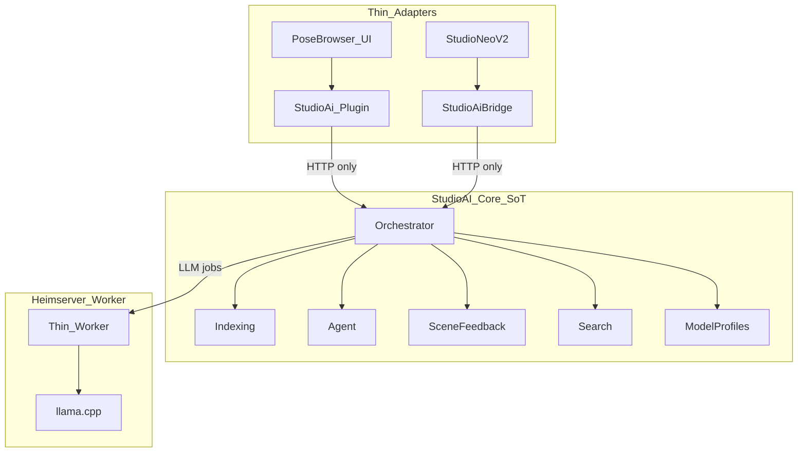
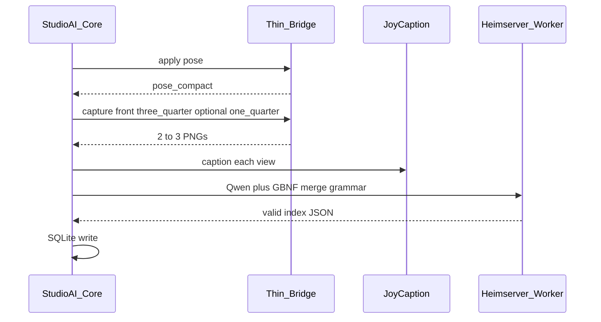

# Studio-AI Stack – Gesamtplan

## Zielbild

Ein **zentrales StudioAI-Core** (Single Source of Truth) orchestriert Indexierung, Suche, Agent und Scene-Feedback. PoseBrowser, Bridge und Heimserver-Worker sind **dünne Adapter** und enthalten keine Geschäftslogik.

Indexierung: **Posecode** (Bones → **regelbasiert** im Core) + **JoyCaption** (Front + Three-Quarter, optional One-Quarter) → **Qwen+GBNF** erzeugt Index-JSON. Chat/RP: **Stheno / Satyr**. Scene-Feedback: Render → JoyCaption (+ optionales `instruction`).




## Architekturprinzip: Single Source of Truth


| Komponente            | Enthält                                                                                                                                            | Darf nicht                                          |
| --------------------- | -------------------------------------------------------------------------------------------------------------------------------------------------- | --------------------------------------------------- |
| **StudioAI-Core**     | Gesamte Business-Logik: Index-Pipeline, Merge-Prompts, GBNF-Schemata, Agent-Tools, Routing, SQLite, Job-Queue, Model-Profile, Scene-Feedback-Logik | –                                                   |
| **StudioAiBridge**    | Apply, Capture, Pose-Read, Scene-Events, Main-Thread                                                                                               | Keine Captions, kein Merge, keine Suche             |
| **StudioAi.Plugin**   | `PoseAiServices.Register`, HTTP→Core, Status-Forward                                                                                               | Keine Index-Logik, kein eigenes Schema              |
| **PoseBrowser**       | Host-APIs, UI-Slots, Filter-Hook für AI-Treffer                                                                                                    | Kein AI-Index, kein LLM, kein JoyCaption            |
| **Heimserver-Worker** | Model-Manager Start/Stop, llama.cpp-Prozess, Health                                                                                                | Keine Studio-Logik; führt nur aus, was Core anfragt |


Core-Version und `index_version` (Prompt/Grammar/Schema) leben nur im Core. Adapter sprechen ausschließlich Core-APIs (`/v1/...`).

## Festgelegte Entscheidungen


| Thema             | Entscheidung                                                                                                                      |
| ----------------- | --------------------------------------------------------------------------------------------------------------------------------- |
| Architektur       | Core = SoT; Bridge/Plugin/PoseBrowser/Worker = thin                                                                               |
| Vision            | JoyCaption nur Haupt-PC                                                                                                           |
| Kamera-Views      | **Front + Three-Quarter**; optional **One-Quarter** bei ungewöhnlicher Rotation                                                   |
| Technical LLM     | **Qwen** für Index-Merge/JSON (+ GBNF); **nicht** für Posecode-Ableitung                                                          |
| RP / Chat LLM     | **Stheno / Satyr** für Agent-Dialog und optionalen Feedback-Polish                                                                |
| Posecode          | **Deterministisch** in Python (Winkel/Regeln → tags/text); Qwen bekommt fertigen Text nur als Merge-Input                         |
| Structured Output | llama.cpp **GBNF-Grammar** erzwingt Index-JSON                                                                                    |
| Backend           | llama.cpp primär, Ollama Adapter; `max_loaded` konfigurierbar                                                                     |
| Indexierung       | Apply → regelbasiertes Posecode + 2–3 Views → JoyCaption → **Qwen+GBNF** Merge                                                    |
| Suche-Validierung | Bereits in **Stufe 3** via FTS-CLI + Batch 100–200 Posen (nicht erst PoseBrowser)                                                 |
| Offline           | Suche + Index (ohne Merge-LLM); Chat/Watch degrade                                                                                |
| Szenenfeedback    | **Visuell:** Studio-Render → JoyCaption; optionales freies `instruction`; Presets; Tür offen für späteres VLM-Profile             |
| Contracts         | **B:** DTOs aus Core-`openapi.yaml` nach C# generieren; AiContracts = Interfaces + generierte Typen; `contract_version` im Schema |
| Lieferung         | Stufen 1–4 → **5a / 5b** mit **PAUSE/Test** dazwischen; nie den ganzen Stack auf einmal                                           |


---

## Lieferstufen (verbindliche Bau-Reihenfolge)

**Regel:** Nur die aktuelle Stufe implementieren. Danach **STOP** – persönlicher Test und Freigabe, bevor die nächste Stufe startet.

```mermaid
flowchart LR
  S1[Stufe1_ModelInfra] --> T1[PAUSE_Test]
  T1 --> S2[Stufe2_LLMChat]
  S2 --> T2[PAUSE_Test]
  T2 --> S3[Stufe3_CaptureDescribe]
  S3 --> T3[PAUSE_Test]
  T3 --> S4[Stufe4_SceneFeedback]
  S4 --> T4[PAUSE_Test]
  T4 --> S5a[Stufe5a_Contracts_Host_Search]
  S5a --> T5a[PAUSE_Test]
  T5a --> S5b[Stufe5b_PB_UI_Agent]
  S5b --> T5b[PAUSE_Test]
```




### Stufe 1 – Model-Infrastruktur

**Ziel:** Modelle managen und zum Laufen bringen (Heimserver).

- Core-Skeleton + thin Worker + Model-Manager (registry, load/unload/swap, `max_loaded`)
- llama.cpp primär; Profiles: Qwen (technical), Stheno, Satyr (chat)
- GBNF-Smoke mit kleinem JSON-Beispiel
- **Nicht:** Bridge, JoyCaption, PoseBrowser, Chat-UI

**Abnahme:** Qwen/Stheno/Satyr laden und Completion/Chat; Health OK; kein Doppel-VRAM.

**→ PAUSE (Test)**

### Stufe 2 – LLM-Chat-Einbindung

**Ziel:** Mit den Modellen normal chatten.

- Core Chat-API (Streaming) + einfache Core-Web-UI oder CLI
- Personas Stheno/Satyr; Role-Routing Chat vs. structured→Qwen+GBNF
- Offline-Hinweis wenn Worker down
- **Nicht:** Studio-Capture, JoyCaption, PoseBrowser

**Abnahme:** Mehrturn-Chat über LAN; Modellwechsel; structured JSON-Probe; Offline-Fehler klar.

**→ PAUSE (Test)**

### Stufe 3 – Capture + Describe (+ Such-Validierung)

**Ziel:** Studio-Bild capturen/beschreiben; Index suchtauglich beweisen – **ohne** PoseBrowser.

- Thin Bridge: Screenshot (`front`/`three_quarter`/`one_quarter`), Apply + `pose_compact`
- JoyCaption im Core; API/CLI `capture` → `describe`
- **Posecode regelbasiert** im Core (`pose_compact` → `posecode_tags` / `posecode_text` via Python-Regeln, kein LLM)
- Posecode-Text + Captions → **Qwen+GBNF** Index-JSON (Merge only)
- SQLite + **FTS** im Core; Search-CLI (`studio-ai search "kneeling from behind"`)
- Batch-Job: **100–200 Posen** indexieren (Testordner)

**Nicht:** Watch-Feedback-UI, PoseBrowser-AI-UI

**Abnahme:**

- [ ] Capture+Describe Front/3Q ok; pose_compact nicht leer
- [ ] Regel-Posecode liefert erwartbare Tags für bekannte Testposen (ohne Qwen)
- [ ] Einzel-Merge → valides GBNF-JSON
- [ ] Batch 100–200 indexiert
- [ ] **FTS-CLI:** ≥10 vorbereitete Testqueries finden die erwarteten Posen (Suchqualität vor UI)

**→ PAUSE (Test)** — Kernfrage „sind Captions suchtauglich?“ ist hier beantwortet.

### Stufe 4 – Echtzeit-Szenenfeedback (visuell)

**Ziel:** Gerendertes Framing per JoyCaption einschätzen.

- Manual / OnDemand / Watch auf Stufe-3-Capture
- Aktive Studio-Kamera → JoyCaption; Preset + optionales freies `**instruction**`
- Optional Chat-Polish (Stheno)
- Erwartung: JoyCaption folgt freien Instructions nur begrenzt (beschreiben > gezielte Kritik); für v1 Preset+Instruction ok
- Model-Profile später erweiterbar um `vision`-Capability (z. B. Qwen2.5-VL) ohne Architekturbruch
- VRAM-Queue vs. Describe/Index
- Einfaches Overlay oder Core-Web-Panel

**Abnahme:** OnDemand = Caption des echten Renders; `instruction` wird ans Prompt gehängt; Watch debounced; Pause bei Index; kein Metadata-Fake.

**→ PAUSE (Test)**

### Stufe 5a – Contracts + Host + Search-Hook

**Ziel:** Andocken vorbereiten; AI-Suche im Grid ohne Chat-UI.

- OpenAPI→C#-Codegen live; AiContracts = Interfaces + generierte DTOs
- thin Plugin → Core (version check)
- Headless `IPoseBrowserHost` wo nötig
- `IPoseBrowserSearchHost` + Filter-Hook (AI-Treffer → Grid)
- Core-Search API nutzen (bereits Stufe 3)

**Abnahme:** Generierte DTOs matchen Core-API; Plugin/Host setzen AI-Suchergebnis → Grid filtert; apply/capture headless.

**→ PAUSE (Test)**

### Stufe 5b – PoseBrowser (pose-only) + Plugin Chat/Feedback + Agent-Tools

**Ziel:** Klare UI-Trennung — PoseBrowser nur posebezogene AI; Chat + Scene-Feedback im StudioAI-Plugin.

**PoseBrowser (nur Pose-Bezug):**

- **Eine** normale Suchleiste für Text- und AI-Suche (keine separate AI-Query-Zeile)
  - Beide Filter **hand in hand** (Intersection): Text-Textfilter ∩ AI-Treffer-Allowlist, solange AI-Suche aktiv
  - **AI-Search-Toggle**: AI-Anteil an/aus; aus = nur normale Suche/Filter wie bisher; an = Query kann zusätzlich Core-FTS anstoßen bzw. AI-Allowlist bleibt wirksam
- Index-UI: Options „alle indexieren“, Action-Panel „Auswahl indexieren“, Progress, Badges indexed/outdated
- Manuelle Tags unangetastet; AI überschreibt `PoseTagDatabase` nicht
- **Nicht** in PoseBrowser: Chat-Panel, Live-Feedback-Overlay, RP-UI, separate AI-Suchleiste

**StudioAi.Plugin (eigenes UI-Fenster / Panel):**

- **Chat-Panel** (Agent Stheno/Satyr über Core)
- **Scene-Feedback im Chat eingebunden** (kein separates Overlay als Haupt-UI):
  - **Live-Feedback (Watch):** im Chat aktivierbar → periodische Feedback-Nachrichten in den Chat-Verlauf; **Eingabefeld gesperrt** solange Live aktiv; User kann Feedback lesen, aber nicht tippen; Deaktivieren → wieder normal chatten
  - **Manuelles Feedback:** Button/Befehl „Szene analysieren“ → eine Feedback-Nachricht in den Chat; **danach normales Chatten** (darauf eingehen erlaubt)
  - **Capture-Thumbnails im Chat:** zu Feedback-/Analyze-/Index-Captures die zugehörigen Screenshots (Studio-Kamera / Index-Views) als Bild im Nachrichtenverlauf anzeigen (nicht nur Text)
- Agent kann Posen **referenzieren/verlinken** (z. B. klickbarer Pose-Pfad / Apply oder „im PoseBrowser zeigen“ über Search-Host)
- Agent-Tools (Core): search/apply/index/analyze (+ list_characters, screenshot, scene summary)

**Abnahme:** Index-Job aus PB; AI-Search im Grid; Chat im Plugin mit manuellem Feedback + Live-Modus (Input lock); Pose-Links aus Chat; degraded ohne Core.

**→ PAUSE (Test)** – danach optional Polish

---

## Architektur-Details (Referenz für spätere Stufen)

Umsetzung der folgenden Abschnitte **nur innerhalb der freigegebenen Lieferstufe**.

### Monorepo `StudioAI/` – Core trägt das Beef

```
StudioAI/
├── core/                      # SINGLE SOURCE OF TRUTH
│   ├── orchestrator/          # Routing, Jobs, Nodes
│   ├── indexing/              # Pipeline, JoyCaption-Client, Posecode, Merge
│   │   ├── joycaption/
│   │   ├── posecode/
│   │   ├── merge/             # Prompts + index_entry.gbnf + schema
│   │   └── store/             # SQLite + FTS + search CLI
│   ├── agent/
│   ├── scene_feedback/        # instruction + presets; später optional vision profile
│   ├── search/                # FTS API/CLI (bereits Stufe 3)
│   └── models/
├── contracts/openapi.yaml
├── adapters/
│   ├── bridge/                # C# thin StudioAiBridge
│   ├── plugin/                # C# thin StudioAi.Plugin
│   └── worker/                # Heimserver: thin model runner + MM process control
└── deploy/
    ├── config.main-pc.yaml    # core primary + joycaption
    └── config.home-server.yaml
```

HS2-Sandbox liefert nur Host-Interfaces + UI-Hooks (`AiContracts`); keine Index-Business-Logic.

### Vorläufer

- JoyCaptionTest → `core/indexing/joycaption/`
- AIPoseManager Bridge/pose_compact → thin `adapters/bridge/` + Posecode-Client im Core
- PoseBrowserExternalApi → Host-Erweiterung in HS2-Sandbox

---

## Phase 0 – Verträge (`AiContracts`)

Shared Interfaces (keine Implementierungslogik):

**Consumer (StudioAi → PoseBrowser / UI nutzt):**

- `IPoseAiSearchProvider`, `IPoseAiChatProvider`, `IPoseAiIndexProvider`, `IPoseAiMetadataProvider`
- `IPoseAiSceneFeedbackProvider` – On-Demand-Analyse + Watch-Mode-Events
- `PoseAiServices` Registry (Register/Unregister)

**Host (PoseBrowser / Bridge stellt bereit):**

- `IPoseBrowserHost` – headless: PoseRoot, Enumerate, Apply, **ApplyAndCaptureAsync**
- `IPoseBrowserSearchHost` – AI-Treffer in `ApplyFilters` einspeisen
- PoseBrowser stellt **keine** Chat-/Feedback-UI bereit; Chat/Feedback-UI = StudioAi.Plugin
- Bridge-seitig: Scene-Change-Events (Charakter hinzugefügt/entfernt, Pose applied, Selection geändert)

DTOs: SearchRequest/Hit, ChatRequest/Context/Sink, IndexJobRequest/Progress, CaptureRequest/Result (**inkl. posecode**), PoseAiMetadata, SceneFeedbackRequest (**inkl. `instruction`**), SceneFeedbackResult.

**Contracts (Entscheidung B – Single Source):**

- SoT: `[StudioAI/contracts/openapi.yaml](contracts/openapi.yaml)` (inkl. `info.version` / `contract_version`)
- C#-DTOs werden daraus generiert (z. B. NSwag / OpenAPI Generator) → landen in AiContracts oder generiertem Nebenprojekt
- `AiContracts` enthält **nur** Interfaces (`IPoseAi`*, `IPoseBrowserHost`, …) + generierte Typen — keine handgeschriebenen Doppel-DTOs
- Plugin prüft beim Register die `contract_version` vom Core gegen die generierte Client-Version
- OpenAPI pflegen ab Stufe 2/3 sukzessive; Codegen-Pipeline spätestens vor **Stufe 5a** aktiv

---

## Phase 1 – Fundament (Core + Thin Bridge + Model Profiles)

### 1.1 Thin StudioAiBridge (C#)

Nur Studio-I/O – Logik bleibt im Core:

- Bestehend: Characters, Bones, Screenshots, Checkpoints, Token-Auth, Main-Thread-Dispatch
- Neu: `POST /v1/indexing/apply-and-capture` – Apply + PNGs für konfigurierte Winkel
- Neu: Response enthält auch `**pose_compact**` (Bone-Regions)
- Headless Apply (ohne PoseBrowser-Fenster)
- Scene Watcher: `GET /v1/scene/summary`, SSE `/v1/scene/events`

**Kamera-Presets (Indexierung):**


| Preset          | Rolle                                                                                                               |
| --------------- | ------------------------------------------------------------------------------------------------------------------- |
| `front_full`    | Primäre visuelle Caption                                                                                            |
| `three_quarter` | Zweite Standard-Caption (Tiefe/Überlappung)                                                                         |
| `one_quarter`   | Optional, wenn Pose stark rotiert / Front unklar (Core entscheidet Heuristik oder Config `always` / `auto` / `off`) |


Kein `side`/`back` mehr als Standard – spart JoyCaption-Durchläufe.

### 1.2 StudioAI-Core (Primary auf Haupt-PC)

Ganze Geschäftslogik; Worker-Node auf Heimserver nur für LLM-Execution.

- Job-Queue, Node-Registry, Health
- Model-**Profiles** (nicht nur IDs):

```yaml
models:
  technical:
    id: qwen-3b-or-7b-q4
    roles: [index_merge, structured_json]   # KEIN posecode_interpret
    grammar: true
  chat:
    id: stheno-8b-q4
    roles: [agent_chat, scene_feedback_polish]
  chat_alt:
    id: satyr-q4
    roles: [agent_chat]
  # später optional:
  # vision_feedback:
  #   id: qwen25-vl-...
  #   roles: [scene_feedback]
  #   capabilities: [vision]
```

Routing nach **Task-Role** → Profile → Node (Heimserver first).

### 1.3 Thin Heimserver-Worker / Model-Manager

- Prozess-Lifecycle für llama.cpp; Download/Registry
- Nimmt Inference-Requests vom Core entgegen inkl. optionaler **GBNF**-Datei/Referenz
- Keine Merge-Prompts und kein Index-Schema lokal speichern (kommen vom Core oder sind an Profile gebunden und vom Core versioniert)

### 1.4 JoyCaption (im Core)

Modul unter `core/indexing/joycaption/`; Gradio optional/dev only.

---

## Phase 2 – Multi-Source-Index (Posecode + 2–3 Views + Qwen/GBNF)




### Signalquellen


| Source          | Was                                                                                         | Stärke                                     |
| --------------- | ------------------------------------------------------------------------------------------- | ------------------------------------------ |
| **Posecode**    | `pose_compact` → **regelbasiert** `posecode_text`/`posecode_tags` (Python, deterministisch) | objektiv: Kniewinkel→kneeling usw.         |
| **JoyCaption**  | Front + Three-Quarter (+ One-Quarter wenn nötig)                                            | visuelle Einschätzung                      |
| **Qwen + GBNF** | Merge → Index-JSON                                                                          | Struktur, Konfliktlösung Haltung vs. Optik |


### Kamera-Policy (Core)

```yaml
indexing:
  cameras:
    always: [front_full, three_quarter]
    optional: [one_quarter]
    one_quarter_mode: auto   # auto | always | off
```

`auto`: One-Quarter nur wenn Pose-Heuristik „komische Rotation“ erkennt (z. B. starker Yaw aus Posecode / Bounding-Box), sonst überspringen.

### GBNF / Structured Output

- Schema-Datei im Core: `core/indexing/merge/index_entry.gbnf` (+ paralleles JSON-Schema zur Doku)
- Felder u. a.: `description`, `tags` (array), `synonyms` (array)
- llama.cpp Request setzt `grammar` / entsprechende Server-Option
- Post-Validate im Core; bei Parse-Fail einmal Retry, dann Fallback Tag-Union

### Merge läuft über Qwen (nicht Stheno)

```
Inputs: posecode_text + captions (front, three_quarter, [one_quarter])
Aufgabe: Index-JSON erzeugen
Konfliktregel: Posecode = Haltung; JoyCaption = Stil/Kleidung/Atmosphäre
Output: strikt Grammar – kein Freitext außerhalb JSON
```

Stheno/Satyr bleiben für Agent-Chat und Scene-Feedback.

### Posecode-Pipeline (regelbasiert, kein LLM)

1. Apply → settle → Bridge `pose_compact`
2. Core-Funktion `derive_posecode(pose_compact) -> { text, tags }` — reine Regeln (Winkel/Schwellen, z. B. Kniewinkel < 90° → `kneeling`); **kein** Modell
3. Speichern: `posecode_raw`, `posecode_text`, `posecode_tags_json`
4. Qwen sieht Posecode erst im **Merge** (zusammen mit Captions); Haltungskonflikte: Posecode gewinnt

Rolle `posecode_interpret` existiert **nicht** im Modell-Profil.

### Fallback ohne Technical-LLM

- `description` = Front-Caption
- `tags` = Union(posecode_tags, caption keywords)

### Speicher

SQLite im **Core**: description/tags/synonyms + captures_json + posecode_* + index_version (Core-owned).

### Performance

- 2 Captions Standard (~halbe Zeit vs. 4 Views); optional 3.
- Posecode billig; Qwen-Merge kurz auf Heimserver.
- Quick-Mode: `sources: [posecode]` oder `[posecode, front]`.

---

## Phase 3 – PoseBrowser-Integration

### PoseBrowser muss liefern (pose-only UI)

1. Headless `IPoseBrowserHost` (nicht an `ActiveInstance` gebunden)
2. `ApplyAndCaptureAsync` auf Main Thread
3. Enumerate über `PoseLibraryIndexCache`
4. `IPoseBrowserSearchHost` + Hook in Filter-Pipeline ([PoseBrowserGridLayout.BuildFilteredDisplayList](H:\Dateien\Dokumente\Repos\HS2-Sandbox\src\PoseBrowser\PoseBrowserGridLayout.cs))
5. UI **nur:** normale Suchleiste (Text ∩ optional AI-Allowlist), **AI-Search-Toggle**, Index-Bar (alle / Auswahl), Status, Badge indexed/outdated — **keine** zweite AI-Suchleiste
6. Manuelle Tags und AI-Tags getrennt (AI überschreibt `PoseTagDatabase` nicht)
7. **Kein** Chat-, Feedback- oder RP-Panel in PoseBrowser

### StudioAi.Plugin liefert

- Thin HTTP-Client zum **Core** + Provider-Register; keine Prompts/Schema/GBNF lokal
- **Eigenes Chat-UI** (IMGUI/Window): Agent-Chat, manuelles + Live-Feedback als Chat-Nachrichten
- Live-Feedback: Watch starten/stoppen; während aktiv → Input disabled; Events als System-/Assistent-Bubbles
- Pose-Links in Chat-Antworten → Apply und/oder PoseBrowser-Filter (`SetAiSearchResults` / `TryApplyPoseByPath`)

### Chat → Search / Pose-Link

Agent-Tool im **Core** `search_poses` → Plugin → optional Grid-Filter + klickbare Referenzen im Chat.  
`apply_pose` / „show in browser“ über Host-APIs.

---

## Phase 4 – Agent + Routing (im Core)

Tools leben im Core: `list_characters`, `screenshot`, `search_poses`, `apply_pose`, `get_scene_summary`, `analyze_scene`, `start_index_job`.

**Role-Routing:**


| Task                         | Model Profile                                                    |
| ---------------------------- | ---------------------------------------------------------------- |
| Index-Merge, structured JSON | `technical` → **Qwen** + GBNF                                    |
| Agent-Chat, RP               | `chat` → **Stheno** / **Satyr**                                  |
| Scene-Feedback               | **JoyCaption** (+ optional `instruction`) → optional chat-Polish |
| Posecode-Tags/Text           | **kein LLM** — Core-Python-Regeln                                |


Node-Routing: Heimserver first → optional Haupt-PC → Offline-Fallback.

VRAM-Scheduler Haupt-PC: JoyCaption exklusiv – Index-Jobs und Scene-Feedback **teilen** dieselbe Vision-GPU; nie parallel, Queue priorisiert (Feedback pausiert Index oder umgekehrt je Config).

---

## Phase 5 – Echtzeit-Szenenfeedback (visuell)

**Ziel:** Einschätzung dessen, **was als Bild entsteht** – der gerenderten Szene, nicht Bone-Metadaten.

Logik im **Core** (`scene_feedback/`). Bridge liefert **Render-Screenshot** (aktive Studio-Kamera / aktuelles Framing).  
**UI sitzt im StudioAI-Plugin-Chat** (nicht PoseBrowser, kein separates Haupt-Overlay).

### Betriebsmodi


| Modus        | Trigger                                          | Chat-Verhalten                                      | Kosten                    |
| ------------ | ------------------------------------------------ | --------------------------------------------------- | ------------------------- |
| **Manual**   | Chat „wie sieht das aus?“ / Tool `analyze_scene` | Feedback-Nachricht; **Input bleibt offen**          | 1 Screenshot + JoyCaption |
| **OnDemand** | Button „Szene analysieren“ im Plugin-Chat        | wie Manual                                          | 1 Shot                    |
| **Watch / Live** | Toggle „Live-Feedback“ im Chat                | periodische Feedback-Bubbles; **Input gesperrt** bis Live aus | Periodisch, VRAM-intensiv |


Default: Manual + OnDemand; Live/Watch **opt-in**. Während Live: lesen + Verlauf ok, tippen/senden nein.

### Datenfluss

```mermaid
sequenceDiagram
  participant Studio as StudioNeoV2
  participant Br as Thin_Bridge
  participant Core as StudioAI_Core
  participant JC as JoyCaption
  participant LLM as Optional_Stheno
  participant ChatUI as StudioAi_Plugin_Chat

  Studio->>Br: scene changed or user request
  Note over Br: debounce if Live Watch
  Br->>Core: PNG from studio camera
  Core->>JC: caption with feedback preset
  JC-->>Core: visual scene description
  opt polish
    Core->>LLM: short tip from caption
    LLM-->>Core: 1 to 3 sentences
  end
  Core->>ChatUI: append feedback message to chat thread
  Note over ChatUI: Live on = input locked; Manual = chat continues
```


### Kontextstrategie (bildzentriert)

1. **Primary:** Screenshot der **aktuellen Studio-Kamera** (Framing, das der User rendern würde).
2. **JoyCaption** mit Feedback-Preset liefert die Einschätzung des Bildes.
3. **Optional:** Stheno/Satyr macht aus der Caption einen kurzen Tipp.
4. **Metadaten / Posecode sind hier unerheblich** – kein Metadata-Fallback als Ersatz für JoyCaption.

### VRAM / Konflikt mit Indexierung

- Feedback **braucht JoyCaption** → kollidiert mit Indexierung.
- Guardrail: Watch/OnDemand und Index-Queue serialisieren; Priorität konfigurierbar.
- Watch-Interval großzügig (≥8–15 s); Max 1 laufender Feedback-Job.

### Prompt-Vertrag (JoyCaption)

Presets: Beschreibend / Kunstkritik / Versaut (NSFW) – „was ist auf dem finalen Bild zu sehen“.  
Optional Chat-Follow-up: 1–3 Sätze Tipps.

### Contracts / APIs

`**IPoseAiSceneFeedbackProvider`:** Modes; `AnalyzeNowAsync`; Watch start/stop; Events.

`**SceneFeedbackRequest`:** `captionPreset`, `cameraSource` (`studio_active` | `front_full`), `**instruction` (optional string)**, `polishWithChat`.

Fussnote: JoyCaption ist beschreibungsstark, instruction-following begrenzt — gezielte „achte nur auf X“-Prompts können übergangen werden. v1: Preset + Instruction; später optional Vision-Profile (Qwen2.5-VL) über `capabilities: [vision]`.

`**SceneFeedbackResult`:** `joyCaptionText`, optional `polishText`, **Thumbnail/PNG-Pfad oder Inline-Bild**, Trigger.

**Bridge:** Screenshot der aktiven Studio-Kamera; SSE nur als Trigger. Keine Metadata-als-Inhalt-Pipeline.

**UI:** Plugin-Chat-Bubbles mit **Bild + Caption** (+ optional Tip); Live-Toggle + Input-Lock; Hinweis „pausiert während Index…“.

### Guardrails

- Kein Feedback ohne erfolgreichen Screenshot + JoyCaption
- Debounce + Coalesce für Watch
- Heimserver offline: JoyCaption-Ergebnis reicht; Chat-Polish entfällt
- Kein stilles Umschalten auf Bone-Summary

---

## Phase 6 – Polish

- Incremental Re-Index, Favoriten-first
- Offline-Status klar in UI (Search / Chat / Watch getrennt)
- Ollama-Backend-Vergleich (Messung)
- OpenAPI vervollständigen
- Chat-Panel im StudioAI-Plugin + optional Orchestrator Web-UI für Ops
- Watch-Tuning: Debounce/Intervall aus User-Config

---

## Deploy (pro Stufe wachsend)


| Stufe | Haupt-PC                              | Heimserver                         |
| ----- | ------------------------------------- | ---------------------------------- |
| 1     | optional Core-Skeleton                | Worker + Model-Manager + llama.cpp |
| 2     | Core Chat-UI                          | wie 1                              |
| 3     | + Bridge + JoyCaption + FTS-CLI/Batch | + Qwen Merge                       |
| 4     | + Scene-Feedback                      | optional Polish                    |
| 5a    | + thin Plugin + Host/Search-Hook      | unverändert                        |
| 5b    | + PB Index/Search; Plugin Chat/Feedback | unverändert                      |


---

## Nicht-Ziele (v1)

- Mehrere Lieferstufen in einem Rutsch bauen
- Geschäftslogik in Bridge/Plugin/PoseBrowser
- JoyCaption auf Heimserver
- Index-Merge mit RP-Modellen (→ Qwen+GBNF)
- Side/Back als Standard-Views
- Metadata-Feedback statt Bild
- Embedding-DB in v1

---

## Arbeitsweise mit dem Agenten

1. Du sagst z. B. „Stufe 1 umsetzen“.
2. Es wird **nur Stufe 1** gebaut.
3. Du testest anhand der Abnahme-Checkliste.
4. Erst nach Freigabe: „Stufe 2“.

